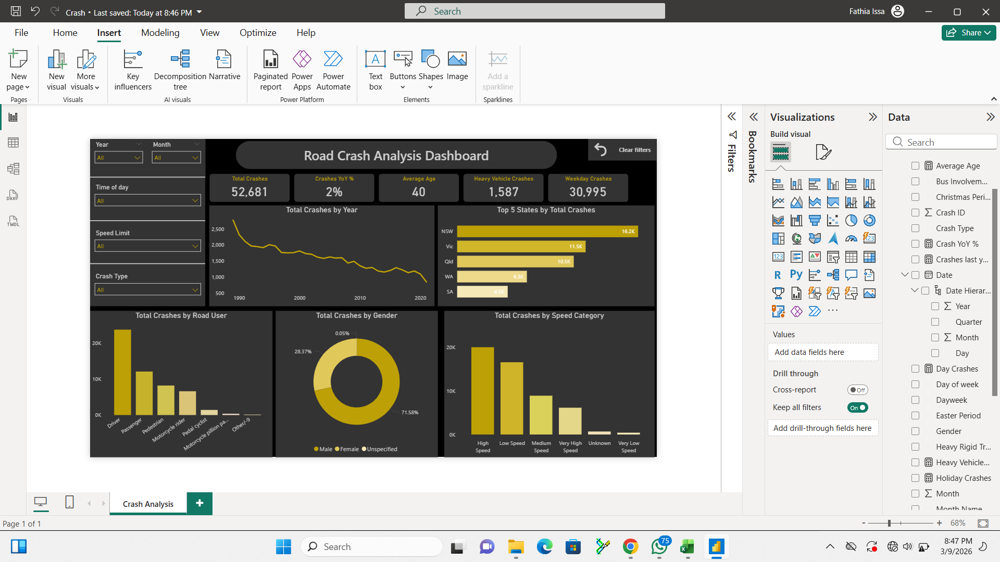

# Road Crash Analysis Dashboard

## Project Overview
This project performs a comprehensive analysis of **Australian road crash data** to uncover patterns in crash frequency, severity, and demographic risk factors. Using Power BI, I designed an interactive dashboard that transforms raw crash records into actionable safety insights — helping identify who is most at risk, when, and where.

## Dashboard
Here's a screenshot of the full dashboard

**Dashboard includes:**
- Total Crashes KPI
- Year-over-Year trend analysis
- Top 5 States by Total Crashes
- Gender distribution (donut chart)
- Road User category breakdown
- Speed Category analysis

All visuals are fully interactive with slicers for **Year, Month, Time of Day, Speed Limit, and Crash Type**.

## What This Project Is About

Road crashes are not random. Behind every statistic is a pattern — a time of day, a road type, a demographic, a speed zone. This project digs into **33 years of Australian crash records** (1989–2021) to find those patterns and turn them into clear, visual insights.
The goal was simple: **To analyse Australian road crash data to find patterns that can improve road safety**.

## Dataset

The raw dataset used for this analysis is included in this repository.

## Tools & Technologies

- **Power BI Desktop** — dashboard design, DAX measures, interactive slicers
- **Power Query** — data cleaning and transformation
- **CSV / Excel** — raw data storage and preprocessing

## How the Data Was Cleaned

Before building the dashboard, the raw data went through several preparation steps in **Power Query**:

- Removed duplicate Crash IDs to avoid inflated counts
- Standardised inconsistent labels in vehicle involvement fields (`"Unknown"` vs blank)
- Validated the date hierarchy and created a proper Year → Month → Day structure
- Built calculated columns for `Day of Week` grouping and `Weekend vs Weekday`
- Handled null and blank entries in `Age` and `Gender` fields
- Confirmed consistency across all categorical fields before loading into the model

## Key Insights

### High-Level KPIs
| Metric | Value |
|---|---|
| **Total Crashes** | 52,681 |
| **Crashes YoY Change** | +2% |
| **Average Age of Road User** | 40 years |
| **Heavy Vehicle Crashes** | 1,587 |
| **Weekday Crashes** | 30,995 |

### Geographic Breakdown
NSW dominates crash records at **16.2K**, followed by Victoria (11.5K) and Queensland (10.5K). WA and SA account for significantly fewer crashes, potentially reflecting population density differences.

### Who Is Most At Risk?
- **Drivers** account for the largest share of road user involvement
- **Males** represent ~71.6% of all crash-involved users — a stark gender disparity
- **High Speed** and **Low Speed** zones see the most crashes by speed category

### When Do Crashes Peak?
- **Weekday crashes** (30,995) outnumber weekend crashes, suggesting commuter traffic as a major risk factor
- Trend analysis shows a **notable decline** from peak crash years in the mid-1990s through to the 2020s — reflecting improved road safety measures

## Author

**Fathia Issa** — Data Analyst with a focus on turning raw data into clear, visual stories.
[Connect with me on LinkedIn](https://www.linkedin.com/in/fathia-issa-9302b7276/)

## License

This project is for educational and portfolio purposes. The dataset is sourced from publicly available Australian road crash records.
